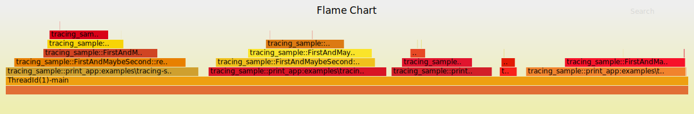

# Tracing Sample

(Named such because `tracing`crate disambiguation didn't work with `cargo run -p tracing:0.0.0`.)

## Running

```cmd
cargo run -p tracing-sample
```

## Rendering

You can render the information logged into `./tracing-sample.folded` into SVG images using `inferno-flamegraph` (`cargo install inferno`).

### Flamegraph

```sh
#!/bin/sh
cat tracing-sample.folded | inferno-flamegraph > flamegraph.svg
```

```nu
#!/bin/nu
open --raw tracing-sample.folded | inferno-flamegraph --flamechart | save flamechart.svg
```


### Flamechart

```sh
#!/bin/sh
cat tracing-sample.folded | inferno-flamegraph --flamechart > flamechart.svg
```

```nu
#!/bin/nu
open --raw tracing-sample.folded | inferno-flamegraph --flamechart | save flamechart.svg
```



## Output

### `stdout`

```html
<UL><LI>recurse = Some(0)</LI><LI>Nested without <CODE>.recurse</CODE>:<BR><UL><LI>recurse = None</LI></UL></LI></UL>
<UL><LI>recurse = Some(1)</LI><LI>Nested without <CODE>.recurse</CODE>:<BR><UL><LI>recurse = None</LI></UL></LI></UL>
<UL><LI>recurse = Some(2)</LI><LI>Nested with <CODE>.recurse</CODE>:<BR><UL><LI>recurse = Some(1)</LI><LI>Nested without <CODE>.recurse</CODE>:<BR><UL><LI>recurse = None</LI></UL></LI></UL></LI></UL>
<UL><LI>recurse = Some(3)</LI><LI>Nested with <CODE>.recurse</CODE>:<BR><UL><LI>recurse = Some(2)</LI><LI>Nested with <CODE>.recurse</CODE>:<BR><UL><LI>recurse = Some(1)</LI><LI>Nested without <CODE>.recurse</CODE>:<BR><UL><LI>recurse = None</LI></UL></LI></UL></LI></UL></LI></UL>
<UL><LI>recurse = Some(4)</LI><LI>Nested with <CODE>.recurse</CODE>:<BR><UL><LI>recurse = Some(3)</LI><LI>Nested with <CODE>.recurse</CODE>:<BR><UL><LI>recurse = Some(2)</LI><LI>Nested with <CODE>.recurse</CODE>:<BR><UL><LI>recurse = Some(1)</LI><LI>Nested without <CODE>.recurse</CODE>:<BR><UL><LI>recurse = None</LI></UL></LI></UL></LI></UL></LI></UL></LI></UL>

```

i.e.:

<!-- markdownlint-disable no-inline-html -->
<UL><LI>recurse = Some(0)</LI><LI>Nested without <CODE>.recurse</CODE>:<BR><UL><LI>recurse = None</LI></UL></LI></UL>
<UL><LI>recurse = Some(1)</LI><LI>Nested without <CODE>.recurse</CODE>:<BR><UL><LI>recurse = None</LI></UL></LI></UL>
<UL><LI>recurse = Some(2)</LI><LI>Nested with <CODE>.recurse</CODE>:<BR><UL><LI>recurse = Some(1)</LI><LI>Nested without <CODE>.recurse</CODE>:<BR><UL><LI>recurse = None</LI></UL></LI></UL></LI></UL>
<UL><LI>recurse = Some(3)</LI><LI>Nested with <CODE>.recurse</CODE>:<BR><UL><LI>recurse = Some(2)</LI><LI>Nested with <CODE>.recurse</CODE>:<BR><UL><LI>recurse = Some(1)</LI><LI>Nested without <CODE>.recurse</CODE>:<BR><UL><LI>recurse = None</LI></UL></LI></UL></LI></UL></LI></UL>
<UL><LI>recurse = Some(4)</LI><LI>Nested with <CODE>.recurse</CODE>:<BR><UL><LI>recurse = Some(3)</LI><LI>Nested with <CODE>.recurse</CODE>:<BR><UL><LI>recurse = Some(2)</LI><LI>Nested with <CODE>.recurse</CODE>:<BR><UL><LI>recurse = Some(1)</LI><LI>Nested without <CODE>.recurse</CODE>:<BR><UL><LI>recurse = None</LI></UL></LI></UL></LI></UL></LI></UL></LI></UL>

<!-- markdownlint-enable no-inline-html -->

### `stderr`

(Using [`tracing-tree`](https://lib.rs/crates/tracing-tree):)

```text
FirstAndMaybeSecond::new{}

print_app{recursion=0}
  FirstAndMaybeSecond::render{recurse=0}
    FirstAndMaybeSecond::new{}

    FirstAndMaybeSecond::render{}
    
  

print_app{recursion=1}
  FirstAndMaybeSecond::render{recurse=1}
    FirstAndMaybeSecond::render{}
    


print_app{recursion=2}
  FirstAndMaybeSecond::render{recurse=2}
    FirstAndMaybeSecond::new{}
    
    FirstAndMaybeSecond::render{recurse=1}
      FirstAndMaybeSecond::new{}
      
      FirstAndMaybeSecond::render{}


  

print_app{recursion=3}
  FirstAndMaybeSecond::render{recurse=3}
    FirstAndMaybeSecond::render{recurse=2}
      FirstAndMaybeSecond::new{}
      
      FirstAndMaybeSecond::render{recurse=1}
        FirstAndMaybeSecond::new{}
        
        FirstAndMaybeSecond::render{}


    
  

print_app{recursion=4}
  FirstAndMaybeSecond::render{recurse=4}
    FirstAndMaybeSecond::render{recurse=3}
      FirstAndMaybeSecond::render{recurse=2}
        FirstAndMaybeSecond::new{}

        FirstAndMaybeSecond::render{recurse=1}
          FirstAndMaybeSecond::new{}

          FirstAndMaybeSecond::render{}


    
  
```

Any parameter that is [`None`](https://doc.rust-lang.org/stable/core/option/enum.Option.html#variant.None),
for example because it is optional and wasn't set, is not reported.

## Sample Output

In addition to text passed through the output streams, a file with timing information is generated (using [`tracing-flame`](https://lib.rs/crates/tracing-flame)):

### `./tracing-sample.folded`

```text
ThreadId(1)-main 2145700
ThreadId(1)-main; tracing_sample::FirstAndMaybeSecond::new:examples\tracing-sample\src\main.rs:8 191600
ThreadId(1)-main 553400
ThreadId(1)-main; tracing_sample::print_app:examples\tracing-sample\src\main.rs:66 478200
ThreadId(1)-main; tracing_sample::print_app:examples\tracing-sample\src\main.rs:66; tracing_sample::FirstAndMaybeSecond::render:examples\tracing-sample\src\main.rs:8 667300
ThreadId(1)-main; tracing_sample::print_app:examples\tracing-sample\src\main.rs:66; tracing_sample::FirstAndMaybeSecond::render:examples\tracing-sample\src\main.rs:8; tracing_sample::FirstAndMaybeSecond::new:examples\tracing-sample\src\main.rs:8 546900
ThreadId(1)-main; tracing_sample::print_app:examples\tracing-sample\src\main.rs:66; tracing_sample::FirstAndMaybeSecond::render:examples\tracing-sample\src\main.rs:8 65148000
ThreadId(1)-main; tracing_sample::print_app:examples\tracing-sample\src\main.rs:66; tracing_sample::FirstAndMaybeSecond::render:examples\tracing-sample\src\main.rs:8; tracing_sample::FirstAndMaybeSecond::render:examples\tracing-sample\src\main.rs:8 100100
ThreadId(1)-main; tracing_sample::print_app:examples\tracing-sample\src\main.rs:66; tracing_sample::FirstAndMaybeSecond::render:examples\tracing-sample\src\main.rs:8 62204100
ThreadId(1)-main; tracing_sample::print_app:examples\tracing-sample\src\main.rs:66 41544800
ThreadId(1)-main 10084800
ThreadId(1)-main; tracing_sample::print_app:examples\tracing-sample\src\main.rs:66 1963600
ThreadId(1)-main; tracing_sample::print_app:examples\tracing-sample\src\main.rs:66; tracing_sample::FirstAndMaybeSecond::render:examples\tracing-sample\src\main.rs:8 11326800
ThreadId(1)-main; tracing_sample::print_app:examples\tracing-sample\src\main.rs:66; tracing_sample::FirstAndMaybeSecond::render:examples\tracing-sample\src\main.rs:8; tracing_sample::FirstAndMaybeSecond::render:examples\tracing-sample\src\main.rs:8 268800
ThreadId(1)-main; tracing_sample::print_app:examples\tracing-sample\src\main.rs:66; tracing_sample::FirstAndMaybeSecond::render:examples\tracing-sample\src\main.rs:8 2724500
ThreadId(1)-main; tracing_sample::print_app:examples\tracing-sample\src\main.rs:66 1827200
ThreadId(1)-main 8584800
ThreadId(1)-main; tracing_sample::print_app:examples\tracing-sample\src\main.rs:66 21192300
ThreadId(1)-main; tracing_sample::print_app:examples\tracing-sample\src\main.rs:66; tracing_sample::FirstAndMaybeSecond::render:examples\tracing-sample\src\main.rs:8 25755800
ThreadId(1)-main; tracing_sample::print_app:examples\tracing-sample\src\main.rs:66; tracing_sample::FirstAndMaybeSecond::render:examples\tracing-sample\src\main.rs:8; tracing_sample::FirstAndMaybeSecond::new:examples\tracing-sample\src\main.rs:8 68800
ThreadId(1)-main; tracing_sample::print_app:examples\tracing-sample\src\main.rs:66; tracing_sample::FirstAndMaybeSecond::render:examples\tracing-sample\src\main.rs:8 24345400
ThreadId(1)-main; tracing_sample::print_app:examples\tracing-sample\src\main.rs:66; tracing_sample::FirstAndMaybeSecond::render:examples\tracing-sample\src\main.rs:8; tracing_sample::FirstAndMaybeSecond::render:examples\tracing-sample\src\main.rs:8 4048400
ThreadId(1)-main; tracing_sample::print_app:examples\tracing-sample\src\main.rs:66; tracing_sample::FirstAndMaybeSecond::render:examples\tracing-sample\src\main.rs:8; tracing_sample::FirstAndMaybeSecond::render:examples\tracing-sample\src\main.rs:8; tracing_sample::FirstAndMaybeSecond::new:examples\tracing-sample\src\main.rs:8 244800
ThreadId(1)-main; tracing_sample::print_app:examples\tracing-sample\src\main.rs:66; tracing_sample::FirstAndMaybeSecond::render:examples\tracing-sample\src\main.rs:8; tracing_sample::FirstAndMaybeSecond::render:examples\tracing-sample\src\main.rs:8 3744000
ThreadId(1)-main; tracing_sample::print_app:examples\tracing-sample\src\main.rs:66; tracing_sample::FirstAndMaybeSecond::render:examples\tracing-sample\src\main.rs:8; tracing_sample::FirstAndMaybeSecond::render:examples\tracing-sample\src\main.rs:8; tracing_sample::FirstAndMaybeSecond::render:examples\tracing-sample\src\main.rs:8 212800
ThreadId(1)-main; tracing_sample::print_app:examples\tracing-sample\src\main.rs:66; tracing_sample::FirstAndMaybeSecond::render:examples\tracing-sample\src\main.rs:8; tracing_sample::FirstAndMaybeSecond::render:examples\tracing-sample\src\main.rs:8 7556000
ThreadId(1)-main; tracing_sample::print_app:examples\tracing-sample\src\main.rs:66; tracing_sample::FirstAndMaybeSecond::render:examples\tracing-sample\src\main.rs:8 8977400
ThreadId(1)-main; tracing_sample::print_app:examples\tracing-sample\src\main.rs:66 11159000
ThreadId(1)-main 5654200
ThreadId(1)-main; tracing_sample::print_app:examples\tracing-sample\src\main.rs:66 12149200
ThreadId(1)-main; tracing_sample::print_app:examples\tracing-sample\src\main.rs:66; tracing_sample::FirstAndMaybeSecond::render:examples\tracing-sample\src\main.rs:8 3389800
ThreadId(1)-main; tracing_sample::print_app:examples\tracing-sample\src\main.rs:66; tracing_sample::FirstAndMaybeSecond::render:examples\tracing-sample\src\main.rs:8; tracing_sample::FirstAndMaybeSecond::render:examples\tracing-sample\src\main.rs:8 2050200
ThreadId(1)-main; tracing_sample::print_app:examples\tracing-sample\src\main.rs:66; tracing_sample::FirstAndMaybeSecond::render:examples\tracing-sample\src\main.rs:8; tracing_sample::FirstAndMaybeSecond::render:examples\tracing-sample\src\main.rs:8; tracing_sample::FirstAndMaybeSecond::new:examples\tracing-sample\src\main.rs:8 60200
ThreadId(1)-main; tracing_sample::print_app:examples\tracing-sample\src\main.rs:66; tracing_sample::FirstAndMaybeSecond::render:examples\tracing-sample\src\main.rs:8; tracing_sample::FirstAndMaybeSecond::render:examples\tracing-sample\src\main.rs:8 27689500
ThreadId(1)-main; tracing_sample::print_app:examples\tracing-sample\src\main.rs:66; tracing_sample::FirstAndMaybeSecond::render:examples\tracing-sample\src\main.rs:8; tracing_sample::FirstAndMaybeSecond::render:examples\tracing-sample\src\main.rs:8; tracing_sample::FirstAndMaybeSecond::render:examples\tracing-sample\src\main.rs:8 33770400
ThreadId(1)-main; tracing_sample::print_app:examples\tracing-sample\src\main.rs:66; tracing_sample::FirstAndMaybeSecond::render:examples\tracing-sample\src\main.rs:8; tracing_sample::FirstAndMaybeSecond::render:examples\tracing-sample\src\main.rs:8; tracing_sample::FirstAndMaybeSecond::render:examples\tracing-sample\src\main.rs:8; tracing_sample::FirstAndMaybeSecond::new:examples\tracing-sample\src\main.rs:8 232200
ThreadId(1)-main; tracing_sample::print_app:examples\tracing-sample\src\main.rs:66; tracing_sample::FirstAndMaybeSecond::render:examples\tracing-sample\src\main.rs:8; tracing_sample::FirstAndMaybeSecond::render:examples\tracing-sample\src\main.rs:8; tracing_sample::FirstAndMaybeSecond::render:examples\tracing-sample\src\main.rs:8 45065000
ThreadId(1)-main; tracing_sample::print_app:examples\tracing-sample\src\main.rs:66; tracing_sample::FirstAndMaybeSecond::render:examples\tracing-sample\src\main.rs:8; tracing_sample::FirstAndMaybeSecond::render:examples\tracing-sample\src\main.rs:8; tracing_sample::FirstAndMaybeSecond::render:examples\tracing-sample\src\main.rs:8; tracing_sample::FirstAndMaybeSecond::render:examples\tracing-sample\src\main.rs:8 144500
ThreadId(1)-main; tracing_sample::print_app:examples\tracing-sample\src\main.rs:66; tracing_sample::FirstAndMaybeSecond::render:examples\tracing-sample\src\main.rs:8; tracing_sample::FirstAndMaybeSecond::render:examples\tracing-sample\src\main.rs:8; tracing_sample::FirstAndMaybeSecond::render:examples\tracing-sample\src\main.rs:8 4329800
ThreadId(1)-main; tracing_sample::print_app:examples\tracing-sample\src\main.rs:66; tracing_sample::FirstAndMaybeSecond::render:examples\tracing-sample\src\main.rs:8; tracing_sample::FirstAndMaybeSecond::render:examples\tracing-sample\src\main.rs:8 19095800
ThreadId(1)-main; tracing_sample::print_app:examples\tracing-sample\src\main.rs:66; tracing_sample::FirstAndMaybeSecond::render:examples\tracing-sample\src\main.rs:8 34471300
ThreadId(1)-main; tracing_sample::print_app:examples\tracing-sample\src\main.rs:66 7841200
ThreadId(1)-main 11013500
ThreadId(1)-main; tracing_sample::print_app:examples\tracing-sample\src\main.rs:66 13683100
ThreadId(1)-main; tracing_sample::print_app:examples\tracing-sample\src\main.rs:66; tracing_sample::FirstAndMaybeSecond::render:examples\tracing-sample\src\main.rs:8 30191800
ThreadId(1)-main; tracing_sample::print_app:examples\tracing-sample\src\main.rs:66; tracing_sample::FirstAndMaybeSecond::render:examples\tracing-sample\src\main.rs:8; tracing_sample::FirstAndMaybeSecond::render:examples\tracing-sample\src\main.rs:8 36380700
ThreadId(1)-main; tracing_sample::print_app:examples\tracing-sample\src\main.rs:66; tracing_sample::FirstAndMaybeSecond::render:examples\tracing-sample\src\main.rs:8; tracing_sample::FirstAndMaybeSecond::render:examples\tracing-sample\src\main.rs:8; tracing_sample::FirstAndMaybeSecond::render:examples\tracing-sample\src\main.rs:8 2372900
ThreadId(1)-main; tracing_sample::print_app:examples\tracing-sample\src\main.rs:66; tracing_sample::FirstAndMaybeSecond::render:examples\tracing-sample\src\main.rs:8; tracing_sample::FirstAndMaybeSecond::render:examples\tracing-sample\src\main.rs:8; tracing_sample::FirstAndMaybeSecond::render:examples\tracing-sample\src\main.rs:8; tracing_sample::FirstAndMaybeSecond::new:examples\tracing-sample\src\main.rs:8 75000
ThreadId(1)-main; tracing_sample::print_app:examples\tracing-sample\src\main.rs:66; tracing_sample::FirstAndMaybeSecond::render:examples\tracing-sample\src\main.rs:8; tracing_sample::FirstAndMaybeSecond::render:examples\tracing-sample\src\main.rs:8; tracing_sample::FirstAndMaybeSecond::render:examples\tracing-sample\src\main.rs:8 13851800
ThreadId(1)-main; tracing_sample::print_app:examples\tracing-sample\src\main.rs:66; tracing_sample::FirstAndMaybeSecond::render:examples\tracing-sample\src\main.rs:8; tracing_sample::FirstAndMaybeSecond::render:examples\tracing-sample\src\main.rs:8; tracing_sample::FirstAndMaybeSecond::render:examples\tracing-sample\src\main.rs:8; tracing_sample::FirstAndMaybeSecond::render:examples\tracing-sample\src\main.rs:8 2278000
ThreadId(1)-main; tracing_sample::print_app:examples\tracing-sample\src\main.rs:66; tracing_sample::FirstAndMaybeSecond::render:examples\tracing-sample\src\main.rs:8; tracing_sample::FirstAndMaybeSecond::render:examples\tracing-sample\src\main.rs:8; tracing_sample::FirstAndMaybeSecond::render:examples\tracing-sample\src\main.rs:8; tracing_sample::FirstAndMaybeSecond::render:examples\tracing-sample\src\main.rs:8; tracing_sample::FirstAndMaybeSecond::new:examples\tracing-sample\src\main.rs:8 68800
ThreadId(1)-main; tracing_sample::print_app:examples\tracing-sample\src\main.rs:66; tracing_sample::FirstAndMaybeSecond::render:examples\tracing-sample\src\main.rs:8; tracing_sample::FirstAndMaybeSecond::render:examples\tracing-sample\src\main.rs:8; tracing_sample::FirstAndMaybeSecond::render:examples\tracing-sample\src\main.rs:8; tracing_sample::FirstAndMaybeSecond::render:examples\tracing-sample\src\main.rs:8 49255600
ThreadId(1)-main; tracing_sample::print_app:examples\tracing-sample\src\main.rs:66; tracing_sample::FirstAndMaybeSecond::render:examples\tracing-sample\src\main.rs:8; tracing_sample::FirstAndMaybeSecond::render:examples\tracing-sample\src\main.rs:8; tracing_sample::FirstAndMaybeSecond::render:examples\tracing-sample\src\main.rs:8; tracing_sample::FirstAndMaybeSecond::render:examples\tracing-sample\src\main.rs:8; tracing_sample::FirstAndMaybeSecond::render:examples\tracing-sample\src\main.rs:8 158800
ThreadId(1)-main; tracing_sample::print_app:examples\tracing-sample\src\main.rs:66; tracing_sample::FirstAndMaybeSecond::render:examples\tracing-sample\src\main.rs:8; tracing_sample::FirstAndMaybeSecond::render:examples\tracing-sample\src\main.rs:8; tracing_sample::FirstAndMaybeSecond::render:examples\tracing-sample\src\main.rs:8; tracing_sample::FirstAndMaybeSecond::render:examples\tracing-sample\src\main.rs:8 11000700
ThreadId(1)-main; tracing_sample::print_app:examples\tracing-sample\src\main.rs:66; tracing_sample::FirstAndMaybeSecond::render:examples\tracing-sample\src\main.rs:8; tracing_sample::FirstAndMaybeSecond::render:examples\tracing-sample\src\main.rs:8; tracing_sample::FirstAndMaybeSecond::render:examples\tracing-sample\src\main.rs:8 2271400
ThreadId(1)-main; tracing_sample::print_app:examples\tracing-sample\src\main.rs:66; tracing_sample::FirstAndMaybeSecond::render:examples\tracing-sample\src\main.rs:8; tracing_sample::FirstAndMaybeSecond::render:examples\tracing-sample\src\main.rs:8 4301300
ThreadId(1)-main; tracing_sample::print_app:examples\tracing-sample\src\main.rs:66; tracing_sample::FirstAndMaybeSecond::render:examples\tracing-sample\src\main.rs:8 31163900
ThreadId(1)-main; tracing_sample::print_app:examples\tracing-sample\src\main.rs:66 9118800
```
