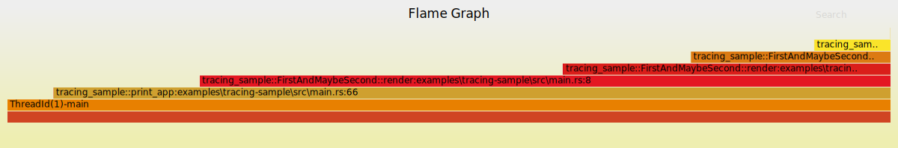

# Tracing Sample

(Named such because `tracing`crate disambiguation didn't work with `cargo run -p tracing:0.0.0`.)

TODO: This isn't actually helpful right now and logging the tracing info to stderr doesn't seem to work.

## Running

```cmd
cargo run -p tracing-sample
```

## Output (`stdout`)

```html
<UL><LI>first = 1</LI><LI>second = Some("2")</LI><LI>Nested:<BR><UL><LI>first = 2</LI><LI>second = None</LI></UL></LI></UL>
```

i.e.:

<!-- markdownlint-disable no-inline-html -->
<UL><LI>first = 1</LI><LI>second = Some("2")</LI><LI>Nested:<BR><UL><LI>first = 2</LI><LI>second = None</LI></UL></LI></UL>
<!-- markdownlint-enable no-inline-html -->

## Sample Output (`./tracing-sample.folded`)

```text
ThreadId(1)-main 683900
ThreadId(1)-main; tracing_sample::FirstAndMaybeSecond::new:examples\tracing-sample\src\main.rs:6 29800
ThreadId(1)-main 21000
ThreadId(1)-main; tracing_sample::FirstAndMaybeSecond::new:examples\tracing-sample\src\main.rs:6 4700
ThreadId(1)-main; tracing_sample::FirstAndMaybeSecond::new:examples\tracing-sample\src\main.rs:6; tracing_sample::FirstAndMaybeSecond::new:examples\tracing-sample\src\main.rs:6 3300
ThreadId(1)-main; tracing_sample::FirstAndMaybeSecond::new:examples\tracing-sample\src\main.rs:6 6900
ThreadId(1)-main; tracing_sample::FirstAndMaybeSecond::new:examples\tracing-sample\src\main.rs:6; tracing_sample::FirstAndMaybeSecond::new:examples\tracing-sample\src\main.rs:6 2700
ThreadId(1)-main; tracing_sample::FirstAndMaybeSecond::new:examples\tracing-sample\src\main.rs:6 3100
```

## Rendering

You can render the logged information above into SVG images using `inferno-flamegraph` (`cargo install inferno`).

### Flamegraph

```sh
cat tracing-sample.folded | inferno-flamegraph > flamegraph.svg
```



### Flamechart

```sh
cat tracing-sample.folded | inferno-flamegraph --flamechart > flamechart.svg
```


